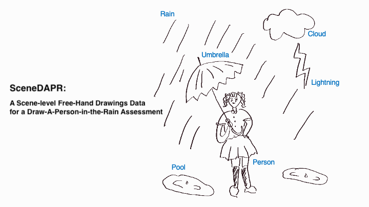
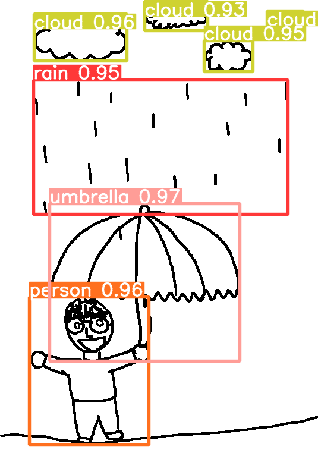

# SceneDAPR: A Scene-level Free-Hand Drawings Data for a Draw-A-Person-in-the-Rain Assessment



$SceneDAPR$ is a novel scene-level sketch dataset, which can be used to automatically analyze the drawing test, Draw-A-Person-in-the-Rain (DAPR), a psychological drawing assessment used for identifying stressful experiences and coping behavior.

# ✨Request for dataset

You need to agree to share your contact information to access the SceneDAPR dataset. 
The Dataset is licensed for **non-commercial scientific research purposes**. Any action that violates the license agreement is prosecutable by law.
Please send an email to jiwonkang@g.skku.edu with the following form. If you do not receive a feedback in 7 days, please contact jinyounghan@skku.edu.
- Name:
- Email:
- Affiliation:
- Short description of your research: 

# Get Started

```
git clone https://github.com/DSAIL-SKKU/SceneDAPR.git
cd SceneDAPR
pip install -r requirements.txt
```

# Data Size

- Data description of scene sketches across the age groups

| Age Group (age) | Children & Adolescents (8-18) | Adults (19-59) | Seniors (60-96) | All |
| :-------------: |  :-----------------: | :------------: | :-------------: | :-: |
|      Total      |       462 (33.02%)                    |      650 (46.46%)       |       287 (20.51%)        | 1,399 (100%) |

- Data description of objects appeared in the collected scene sketches across the six DAPR object categories among the total number of 148 object categories

| DAPR object | Person | Rain | Umbrella | Cloud | Puddle | Lightning |  All  |
| :----: | :----: | :--: | :------: | :--: | :-------: | :---: | :---: |
| Total  |  1,723   | 1,498  |    826  |    621     |  468 | 105 | 5,239 |

# Data Structure

SceneDAPR consists of 1,399 scene-level free-hand drawings along with segmentation labels of 6,420 object-level sketches. Furthermore, our dataset provides the sequential stroke order of the sketches and metadata about the drawing (e.g., drawing time) and its drawer (e.g., age and gender)

- `dataset/collected`: Scene-level free-hand drawings of the diverse age groups
- `dataset/synthesized`: This dataset is used for data augmentation. The synthesized sketches are created based on layout template, including the locations of the objects from the collected scene sketches. We replace images with other alternative drawings for the given objects.

The SceneDAPR dataset is structured as follows. All the files are provided with a canvas size of 757x535 (hxw).

- Data Desctipion (`dataset/final-dataset-dist.csv`)
  - image ID
  - age group	(children & adolescents, adults, seniors)
  - age
  - dataset (train & test split)
  - gender
  - self-reported description of the drawing
    - mainCharacter: Who is the main character in the picture? (Optional)
    - emotion: How does the main character in the picture feel?
    - activity: What is the person in the picture doing?
    - situation: Why is the person in the picture standing in the rain?
    - expectation: What will happen to the person in the picture in the future?
    - need: What does the person in the picture need?
  - drawing time
  - stroke count
  - stroke length
- Pixel-based: a image file (`.png`) of the scene-level sketch
  - `dataset/collected/png`
  - `dataset/synthesized/creation/png`
- Stroke-based: a vector file (`.svg`) of the scene-level and object-level sketch. The Ramer–Douglas–Peucker algorithm with an epsilon value of 0.5 used to simplify all strokes
  - Scene-level: `dataset/collected/svg-scene`
  - Object-level: `dataset/collected/svg-object`

  - (Tip) To convert `.svg` to an array of the coordinate (x,y), you can use a `svg_to_coordinate` function in `src/preprocessing.py`

# Tasks and Metrics

The proposed SceneDAPR supports the object detection task for coarse-grained analysis.

## ▶️ Object Detection Task



### Requirements

```
pip install -r ultralytics/requirements.txt
```

- Complete the root path in the `dataset/yolo-exp-All.yaml`

```
...
path: /path/to/dataset # dataset root dir
...
```

### Training with YOLOv8

```
# Example with YOLOv8-nano

yolo train model=yolov8n.pt data="dataset/yolo-exp-All.yaml" epochs=300 batch=16
```

- Other Options: If you want to train the model to investigate the effect on age-biased datasets, you can use as following options instead of `-data dataset/yolo-exp-All.yaml`.
    - `-data dataset/yolo-exp-children-Adolescents.yaml` (Children&Adolescent-biased)
    - `-data dataset/yolo-exp-adults.yaml` (Adult-biased)
    - `-data dataset/yolo-exp-seniors.yaml` (Senior-biased)

### Inference with the pretrained weights (Train Set: Synthesized + Collected; All)

```
yolo predict model=weights/yolov8-all.pt source=inference_test.jpg
```

- Other Options: You can use as following options to inference with your data instead of `-source inference_test.jpg`.
    - `-source path/` # for directory
    - `-source path/*.jpg` # for glob

---
### If our work was helpful in your research, please kindly cite this work:

```
BIBTEX
@inproceedings{kang2024scenedapr,
  title={SceneDAPR: A Scene-Level Free-Hand Drawing Dataset for Web-based Psychological Drawing Assessment},
  author={Kang, Jiwon and Kim, Jiwon and Yang, Migyeong and Park, Chaehee and Kim, Taeeun and Song, Hayeon and Han, Jinyoung},
  booktitle={Proceedings of the ACM on Web Conference 2024},
  pages={4630--4641},
  year={2024}
}
```

# License

- This work is made available under Creative Commons Attribution-NonCommercial 4.0 International license (CC BY-NC 4.0)

- If you want to use the SceneDAPR for psychological tasks, we intend to use the dataset to develop an automated system with a human-in-the-loop feedback system. We do not intend to substitute and exclude human experts in psychological tasks.

# Maintence

This repository is maintained by [Jiwon Kang](https://github.com/ji1kang) and [Jiwon Kim](https://github.com/jiwon-km). Any feedback, extensions & suggestions are welcome! Please send an email to jiwonkang@g.skku.edu.

# Cutsom the Dataset

  <details><summary>Synthesizing for more drawings</summary>
  <p>

1. Download external datasets for the objects (rain, person, umbrella, lightning, pool, and cloud). The external drawings and their download links the SceneDAPR dataset used as follows:

- Person, Umbrella, Cloud: TU-Berlin in a `.png` format [[download](https://cybertron.cg.tu-berlin.de/eitz/projects/classifysketch/)]
- Rain, Umbrella, Puddle, Lightning, Cloud: QuickDraw! in a `.ndjson` format [[download](https://github.com/googlecreativelab/quickdraw-dataset)]

2. Complete the cofiguration of `dataset_paths` and `category_sample_paths` in `config.py`

```
dataset_paths = {
  "quickdraw": "/path/to/ndjson/",
  "tu-berlin": "/path/to/png/",
}

category_sample_paths = {
  "rain": [{
    "format": "ndjson", # Default: ndjson (Available format: png, jpg, and ndjson)
    "dataset": "quickdraw", # Default: quickdraw
    "path": # Default: dataset_paths["quickdraw"] + "rain.ndjson"
    }
  ],
  # ...Complete the configuration of other categories...
}
```

3. Run `scene_augmentator.py` for synthesizing more drawings based on the collected drawings. Then, you can obtain (i) the synthesized images (`.png`) and (ii) the corresponding COCO format file (`.json`)

```
python scene_augmentator.py -N 10 \
  --save_dir dataset/augmentation/png/ \
  --mask_info_dir dataset/230530-train_6_classes-1399.json \
  --save_info_dir dataset/augmentation/230530-train_6_classes-1399-aug.json \
  --png_save_dir dataset/augmentation/object_png/
```

4. (Optional) If you want to conduct experiments with a YOLO model, then run `coco2yolo.py` to convert the COCO format file for compatibility

```
python coco2yolo.py --img_folder dataset/png/ \
 --yolo_folder dataset/yolo/ \
 --coco_file dataset/230530-train_6_classes-1399.json \
 --split_file dataset/final-dataset-230530-dist-1399.csv
```

  </p>
  </details>

  <details><summary>Create your own dataset</summary>
  <p>

- This repository contains a web-based drawing collection system used in the paper

1. Run a client

```
cd collection_system/client
npm i # install dependencies
npm start # dev
```

2. Run a server

```
cd collection_system/server
prisma db push # init database
uvicorn main:app --reload
```

  </p>
  </details>
